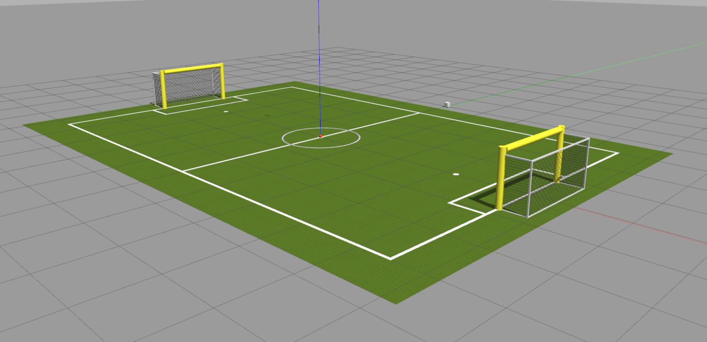
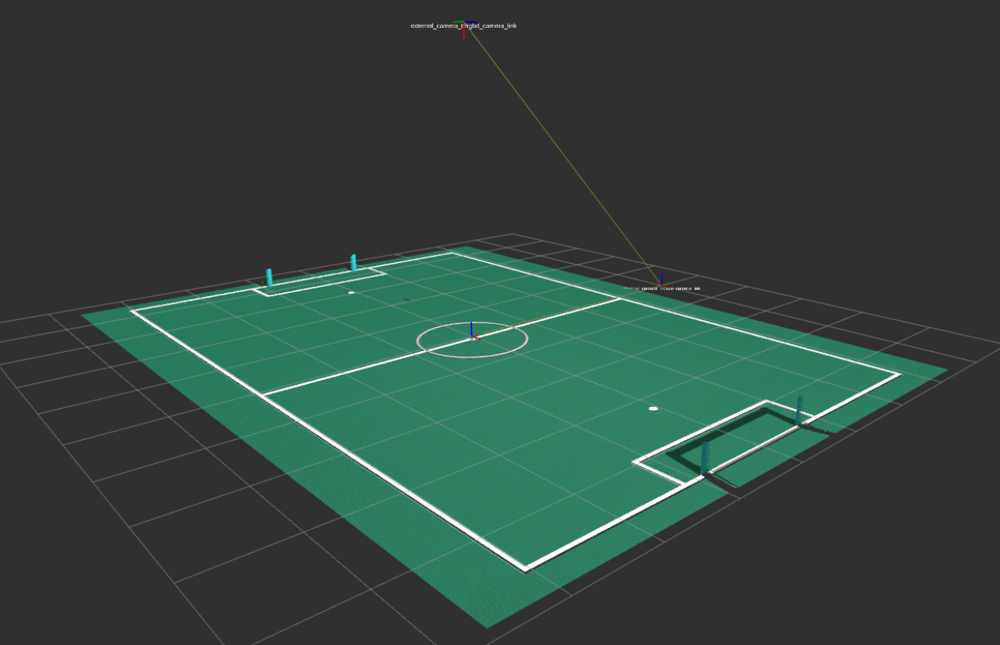

# Robot Competition Scene

## Gazebo Scene

## Rviz Scene

## Commands
To launch the world:
~~~
roslaunch robot_competition_scene game_field.launch
~~~
Optional Arguments:
* *rviz:=false*. By default, *rviz := true*

---
 

## MODELS FROM:

[Gazebo Models (OSRF)](https://github.com/osrf/gazebo_models):

* [**robocup_spl_ball**](https://github.com/osrf/gazebo_models/tree/master/robocup_spl_ball)
* [**robocup14_spl_field**](https://github.com/osrf/gazebo_models/tree/master/robocup14_spl_field)
* [**robocup14_spl_goal**](https://github.com/osrf/gazebo_models/tree/master/robocup14_spl_goal)
* [**robocup09_spl_field**](https://github.com/osrf/gazebo_models/tree/master/robocup09_spl_field)
